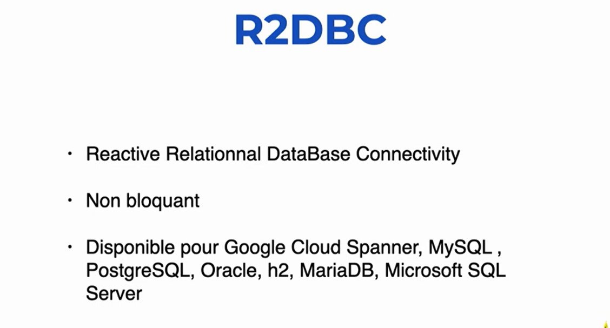
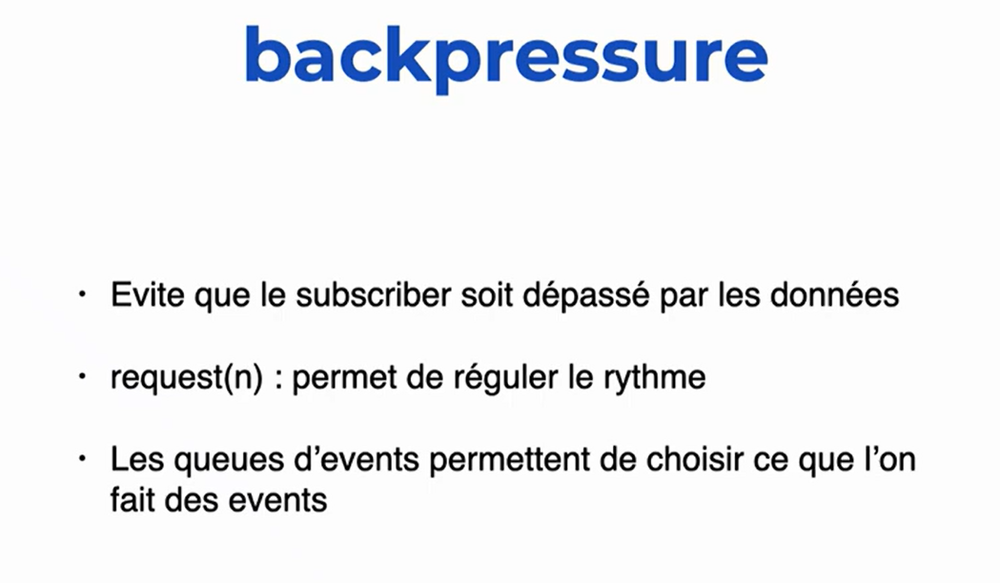
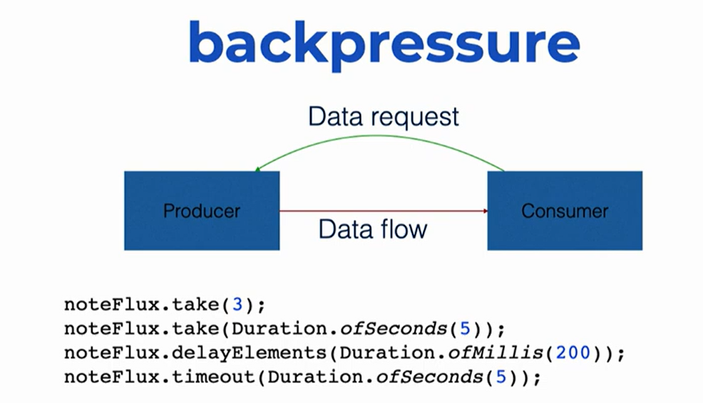
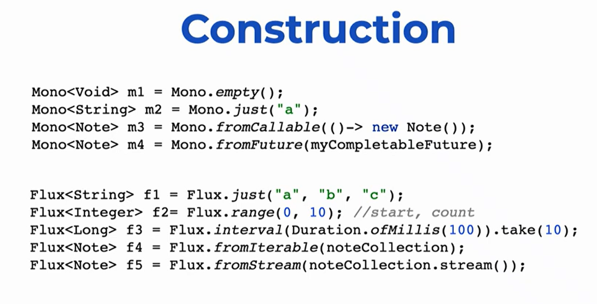

# SPRING REACTIVE

Spring Reactive, également connu sous le nom de Spring WebFlux, est une 
extension du framework Spring qui permet de créer des applications 
réactives pour le développement d'applications orientées vers la 
réactivité, la scalabilité et la faible latence. Contrairement au modèle
 traditionnel basé sur les servlets, Spring Reactive adopte un modèle de
 programmation asynchrone et non bloquant pour gérer les charges de 
travail élevées et les opérations intensives en termes de temps.

Il est oriente autour des flux de donnees et la programmation de changements. Les flux de donnees pilotes par des evenements et messages.

Contrairement a Spring MVC ou on a un thread pour chaque requete ,ici un thread peut traiter plusieurs requetes a la fois

Dans le contexte de Spring Reactive, le module principal est `Spring WebFlux`, qui fournit des fonctionnalités réactives pour le développement d'applications web. Voici quelques concepts clés liés à Spring Reactive :

1. **Flux et Mono :** Ces deux types, fournis par le projet Reactor (une bibliothèque réactive pour Java), sont utilisés pour représenter des flux de données asynchrones. Un Flux est une séquence de zéro à plusieurs éléments, tandis qu'un Mono représente soit un élément unique, soit l'absence d'élément.

2. **Publisher et Subscriber :** Dans le modèle réactif, un Publisher émet des éléments de données, et un Subscriber les consomme. Lorsqu'un Publisher émet un élément, il le pousse vers le Subscriber, qui peut ensuite réagir en conséquence.

3. **Opérations de transformation :** Les flux réactifs permettent d'appliquer des opérations de transformation pour traiter et manipuler les données. Ces opérations peuvent inclure la transformation, le filtrage, la concaténation, etc.

4. **Schedulers :** Les schedulers permettent de contrôler le thread sur lequel s'exécutent les opérations réactives. Cela permet de gérer efficacement les opérations bloquantes ou de déplacer les opérations entre différents threads.

5. **Annotations et API :** Spring Reactive fournit des annotations telles que `@RestController` et `@RequestMapping` pour définir des points d'entrée réactifs, tout en utilisant le modèle de programmation fonctionnelle ou basé sur des flux pour gérer les requêtes et les réponses.

### TUTORIALS

- [Dois-je migrer en Reactive et comment ? (Christophe Jollivet) - YouTube](https://www.youtube.com/watch?v=WTZOGQYsdqE&t=755s) 

### ATTENTION AUX IMPORT

il doit y avoir **reactive** dans les import

### FONCTIONNEMENT

- Lors d' une requete du client est traite par un thread qui passe en suite a la requete suivante sans attendre la reponse de la base de donnees.

Spring Reactive, également connu sous le nom de Spring WebFlux, est une extension de Spring Framework conçue pour prendre en charge la programmation réactive dans le développement d'applications web. Contrairement au modèle traditionnel basé sur des threads (thread-based), la programmation réactive se concentre sur la gestion efficace des flux de données asynchrones et permet de gérer de manière efficace les charges de travail élevées avec une utilisation optimale des ressources.

Voici comment fonctionne Spring Reactive pour le web :

1. **Flux et Mono** :
   
   - Spring Reactive introduit deux types principaux : Flux et Mono.
   - Un Flux représente un flux asynchrone de zéro à plusieurs éléments. Cela peut être utile pour gérer des listes ou des séquences d'éléments.
   - Un Mono est une version simplifiée de Flux qui représente un flux asynchrone d'au plus un élément. Cela peut être utilisé pour les opérations où un seul résultat est attendu.

2. **Gestion asynchrone** :
   
   - Dans le modèle réactif, les opérations sont gérées de manière asynchrone. Au lieu de bloquer des threads jusqu'à ce qu'une opération soit terminée, le système peut gérer efficacement de multiples opérations en utilisant un nombre limité de threads.
   - Cela permet de réduire la consommation de ressources et d'améliorer l'évolutivité de l'application, ce qui est particulièrement important dans les environnements à forte charge.

3. **Handler Functions** :
   
   - Dans Spring Reactive, vous définissez des fonctions de gestionnaire (handler functions) pour gérer les requêtes HTTP.
   - Ces fonctions de gestionnaire renvoient généralement des objets Flux ou Mono, en fonction du nombre d'éléments attendus dans la réponse.

4. **Routes et Routers** :
   
   - Les routes sont définies pour associer des URI spécifiques à des fonctions de gestionnaire.
   - Vous pouvez configurer des routers pour déterminer comment les requêtes HTTP sont traitées et dirigées vers les fonctions de gestionnaire appropriées.

5. **WebClient** :
   
   - Spring Reactive fournit un WebClient qui permet aux applications de faire des appels HTTP sortants de manière réactive.
   - Le WebClient peut être utilisé pour interagir avec d'autres services web réactifs ou non réactifs.

6. **Schedulers** :
   
   - Les Schedulers permettent de contrôler où et comment les opérations asynchrones sont exécutées.
   - Vous pouvez spécifier sur quel thread une opération réactive particulière doit s'exécuter, ce qui est utile pour gérer les contextes de thread et éviter les problèmes de concurrence.

### R2DC

### BACKPRESSURE

Le backpressure est un concept important dans les systèmes réactifs et les flux de données asynchrones. Il se réfère à la gestion de la quantité de données ou d'événements qu'un producteur émet vers un consommateur lorsque le consommateur n'est pas capable de traiter ces données au même rythme. En d'autres termes, le backpressure survient lorsque le consommateur demande au producteur de ralentir la production de données afin de ne pas être submergé.

### BACKPRESSURE IMPLEMENTATION

### REACTIVE STREAM

### CONSTRUCTION EXAMPLE

